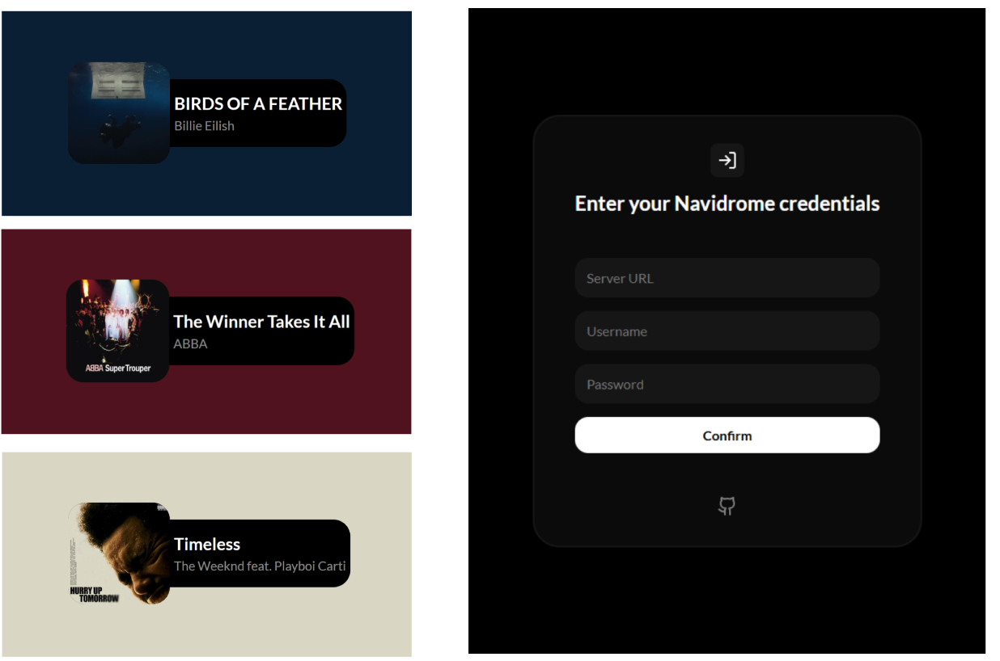

# NaviOverlay

🎵 Now Playing Overlay for [Navidrome](https://github.com/navidrome/navidrome/) music servers. It displays real-time playback info like track title, artist, and album art in a stream-friendly overlay you can use on OBS, Twitch, or any custom frontend or videos.
It's a simple tool for those who want a private way to display what they're listening to, fully privately.

Note: I'm still a beginner and this is my first open source project feel free to criticize and contribute to the project as much as you want, hope you like it :)



## Features
 
 - Real-time now playing info from your private Navidrome server
 - Clean, customizable HTML/CSS overlay for OBS or videos
 - pulls metadata directly from the server using the Subsonic API
 - Great support for **compilations** (Various Artists albums) and **box sets** (multi-disc albums)
 - **Multi-user**, each user has their own play counts, playlists, favourites, etc...
 - fully open source and GPLv3-licensed

# Deployment Options
## (I highly recommend self-hosting for privacy and security)

##  Self-Host (Recommended) 
- Download and run on your own server/domain
- Configurable or unlimited link expiry
- Your data stays on your server
- Full control

## Use my hosted Version 
- Quick setup at https://navioverlay.vercel.app
- 48-hour link expiry for privacy protection
- No setup required 

# Installation Guide

## Requirement
- [Node.js](https://nodejs.org/en/download)
- A running [Navidrome](https://github.com/navidrome/navidrome/) music server
- (Optional) [OBS](https://obsproject.com/) or Streamlabs if you plan to use the overlay in streams or recordings

## Clone the Repository 
 Clone or download the Repository
```bash
git clone https://github.com/yourusername/navioverlay.git
cd navioverlay
```

## Install Dependencies
```bash
npm install
```
## Configure Settings
 Edit ```config/settings.js``` to customize:

 ```js
module.exports = {
    // Token expiration in days
    // 0 = never expire (recommended for self-hosting)
    expires: 0,  // example 2 = expire after 2 days 

    // Server port
    port: 3000,
};
```

## Start the Server
 Go to the main directory and open terminal/cmd and type
```bash
node navioverlay.js
```
You should see 
```bash
🎵 NaviOverlay server running on http://localhost:3000
⚙️ Config: expires after X days
```

## Generate Overlay Link 
- Open your browser and go to http://localhost:3000 or whatever port you set in the config
- Enter your Navidrome server URL, username, and password starting from http:// or https://
- Click confirm -> It will redirect you to the generated link that contains the overlay
- Copy the link on the address bar 

## Use in OBS or Streamlabs with Browser Source
- in OBS or SLOBS or whatever software you wanna use it with, add a new **Browser Source**,
- Paste the URL that you copied and click Done :)

## Development and Packages
- This project runs on Node ```v22.16.0``` and uses a minimal backend.

- [express](https://www.npmjs.com/package/express)

- [cors](https://www.npmjs.com/package/cors)

## License

[GNU General Public License v3.0 ©](https://github.com/DaveKai/NaviOverlay/blob/main/LICENSE)
